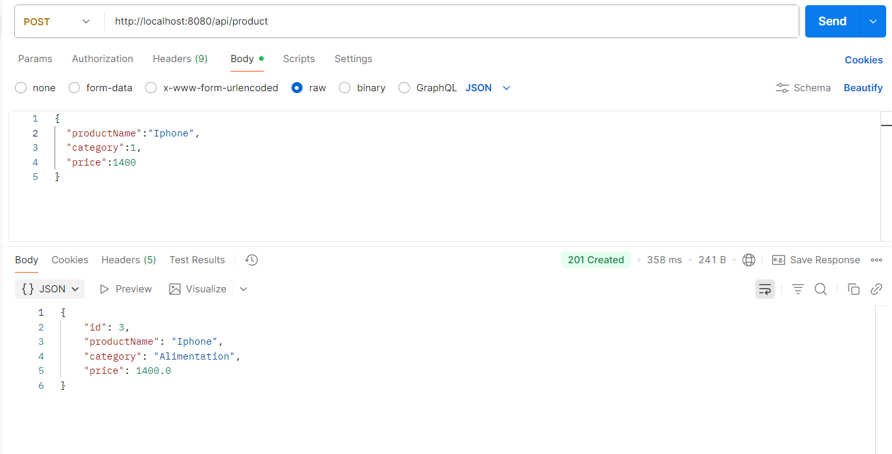
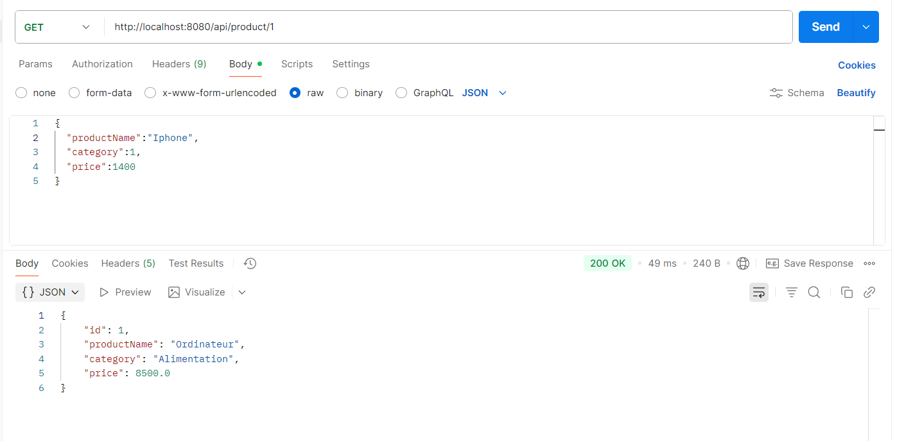

# 💻 Microservices_API_Exchange — Spring Boot

Ce projet illustre la création de **deux microservices indépendants** développés avec **Spring Boot** :
- **Micro_Product** : gère les produits (nom, prix, catégorie, etc.)
- **Micro_Achat** : gère les achats et consomme le service Produit via **WebClient**

L’objectif est de démontrer une architecture **microservices** basée sur **REST**, **MySQL**, **MapStruct**, et **Spring Data JPA**.

---

## 🚀 Objectifs du projet

1. **Appliquer le modèle microservices** : chaque service a sa base de données, son code et son port.
2. **Assurer la communication inter-services** : grâce à `WebClient`.
3. **Utiliser les bonnes pratiques Spring Boot** : DTO, Mapper, Repository, Service, Controller.

---

## ⚙️ Technologies utilisées

| Outil / Framework | Rôle |
|--------------------|------|
| **Java 17+** | Langage principal |
| **Spring Boot 3+** | Framework backend |
| **Spring Data JPA** | Accès base de données |
| **MapStruct** | Mapping DTO ↔ Entité |
| **WebClient** | Communication entre microservices |
| **MySQL (XAMPP)** | Base de données |
| **Maven** | Gestion de dépendances |
| **IntelliJ IDEA** | Environnement de développement |
| **Postman** | Test des endpoints |

---

## 🧱 Structure du projet

1. Produit :
   

2. Achat :
  

## Captures d'écrans 

1. Produit :
   
   

2. Achat :

